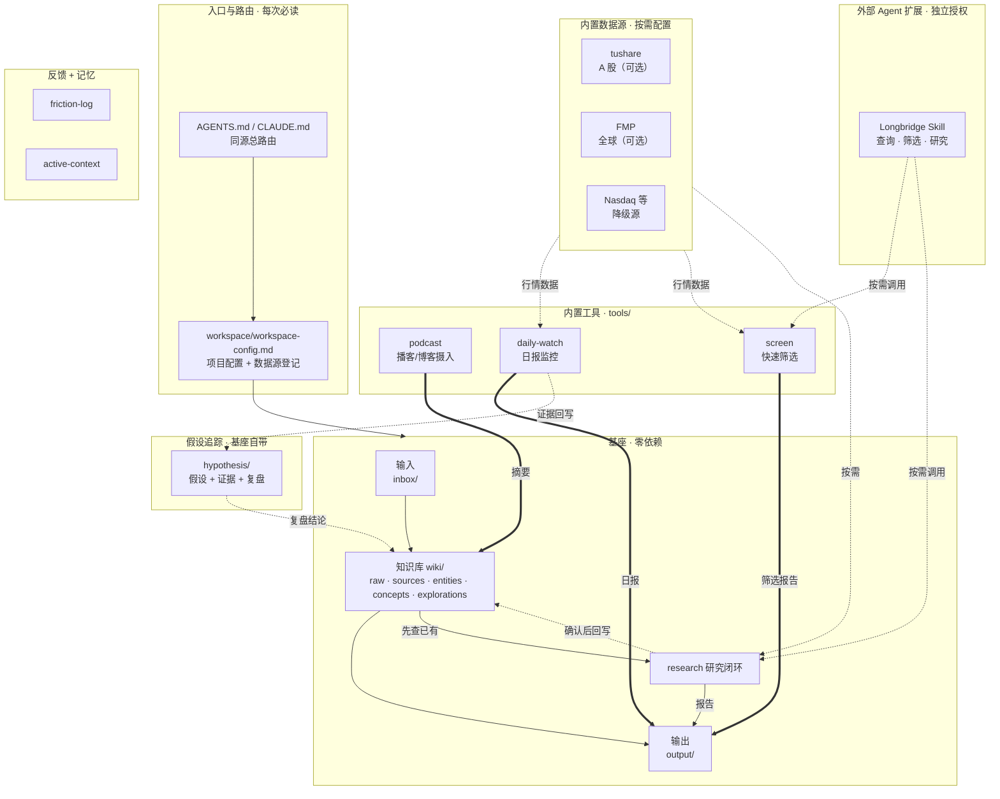

# 系统架构 · Lodestar

> 截至 2026-06-22（v0.3.0 All-in-One）。给"想看懂这套系统怎么搭"的人看的参照图，不是每次必读文件。
> 一句话：**一个 all-in-one AI 研究工作系统——六大能力开箱即用，数据源按需配置，零 key 也能跑。**

---

## 架构图



### 怎么读这张图

- **实线** = 主数据流。
- **粗箭头 `==>`** = 工具写入基座。
- **虚线** = 反馈 / 回写 / 可选连接。
- **基座(BASE)零依赖**：clone 下来立刻能跑 `inbox → wiki → output` + research。
- **内置工具(TOOLS)**：代码在 `tools/` 下，首次使用时 agent 用 `python3 -m pip install ...` 安装依赖；若环境只有 `python`，则替换成 `python -m pip ...`。
- **数据源(DATA)**：配了才用，没配降级不报错。

---

## 六大能力

| 能力 | 类型 | Skill 文件 | 代码 | 依赖 |
|------|------|-----------|------|------|
| 个人 wiki | 基座 | `system/integrations/personal-wiki.md` | markdown 读写 | 无 |
| 研究闭环 | 基座 | `system/skills/research.md` | markdown + websearch | 无 |
| 快速筛选 | 基座 | `system/skills/screen.md` | agent 驱动 + 可选 API | 无 |
| 假设追踪 | 基座 | `system/integrations/hypothesis-tracker.md` | markdown 读写 | 无 |
| 播客摄入 | 工具 | `system/skills/podcast.md` | `tools/podcast/scripts/` | Python + LLM key |
| 日报监控 | 工具 | `system/skills/daily-watch.md` | `tools/daily-watch/scripts/` | Python + 可选 API |

---

## 数据源

| 数据源 | 市场 | 费用 | 用于 |
|--------|------|------|------|
| tushare | A 股 (.SH/.SZ) | 按官方套餐 | daily-watch, screen, research |
| FMP | 全球 | 按官方套餐 | daily-watch, screen, research |
| Nasdaq / Finnhub / EOD / yfinance | 各自覆盖市场 | 各自规则 | daily-watch 降级源 |
| websearch | — | Agent 自带 | 全部能力的兜底 |
| Longbridge Skill | 以官方支持范围为准 | 独立安装与授权 | screen, research 外部扩展 |

日报脚本按市场使用 tushare / FMP，并在缺失或请求失败时尝试 Nasdaq、Finnhub、EOD、yfinance。零 Key 时仍生成报告骨架，Agent 可用 websearch 补充；Longbridge 不在日报脚本调用链中。

---

## 目录结构

```text
lodestar/
│
├── AGENTS.md / CLAUDE.md           # 入口：总路由（同源）
├── ARCHITECTURE.md                 # 本文件
├── README.md                       # 门面
├── INSTALL-FOR-AI.md               # AI agent 安装协议
├── SMOKE-TEST.md                   # 装完自检
├── requirements.txt                # 合并依赖
├── requirements-pdf.txt            # PDF 可选依赖
│
├── config/                         # 用户配置（不入 git）
│
├── tools/                          # 内置工具
│   ├── podcast/                    #   播客/博客摄入
│   │   ├── scripts/                #     Python 脚本
│   │   ├── examples/               #     默认配置模板
│   │   └── .env.example            #     LLM key 模板
│   └── daily-watch/                #   日报监控
│       ├── scripts/                #     Python 脚本
│       ├── config-examples/        #     配置模板
│       └── templates/              #     报告/假设 markdown 模板
│
├── workspace/
│   ├── workspace-config.md         # 项目配置
│   └── meta/
│       ├── active-context.md       # 工作记忆
│       └── friction-log.md         # 摩擦日志
│
├── wiki/                           # 知识库
│   ├── _schema.md
│   ├── raw/ / sources/ / entities/ / concepts/ / explorations/
│
├── inbox/                          # 输入
├── output/                         # 输出（research/ screen/ pod2wiki/ 等子目录）
├── monitoring/                     # 监控对象
├── hypothesis/                     # 假设追踪
├── daily-watchlist-reports/        # 日报输出
├── portfolio/                      # 交易记录
│
├── system/                         # 机器零件箱
│   ├── skills/                     #   能力说明书
│   ├── integrations/               #   内部接线说明
│   ├── interfaces/                 #   已启用工具总览
│   ├── scripts/                    #   基座脚本（install_workspace.py / check_workspace.py / pdf_to_md.py）
│   └── templates/                  #   安装时复制的模板文件
│
└── _archive/                       # 归档区
```

---

## 完整闭环

```text
podcast ──► wiki ──► daily-watch ──► output/ ──► hypothesis ──► wiki/explorations
               │                                                      ▲
               └──────────── research / screen ────────────────────────┘
```

基座保证 `inbox → wiki → output + research`。其余能力按配置渐进亮灯。

<!-- 文件说明：系统架构、能力分层和目录关系说明。 -->
